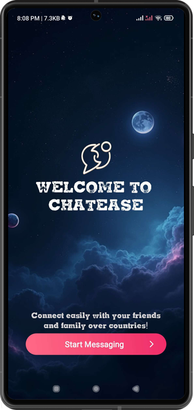
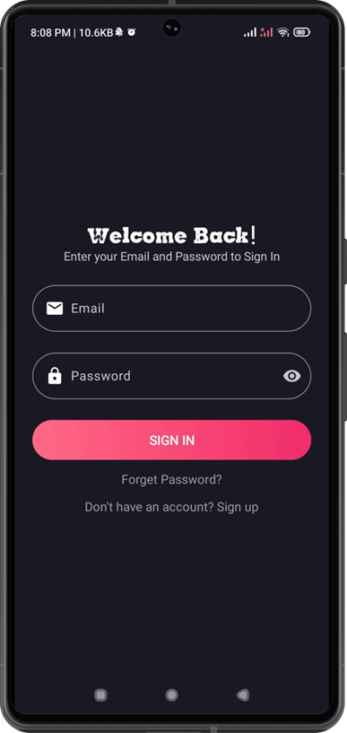
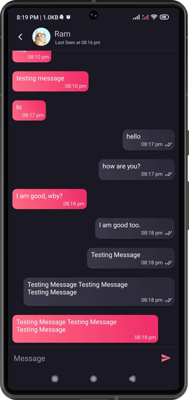

# 💬 ChatEase – Real-Time Messaging Application

A real-time chat application built using **Kotlin** and **XML**, with full integration of **Firebase services** to deliver a smooth, scalable, and responsive messaging experience.  
**Supports Android 8.1 (API 27)** and above.

## 📱 Overview

ChatEase allows users to engage in **real-time 1-on-1 and group messaging**, manage friend connections, customize profiles, and receive smart notifications - all while leveraging a clean and modern UI built with Material Design.

## 🚀 Features

- 🔐 **Secure Authentication** with Firebase (email)
- 💬 **1-on-1 and Group Messaging** in real time
- 🧑‍🤝‍🧑 **Friend Management** (add, view, and remove friends)
- 🖼 **Profile Customization** (image upload, crop with Ucrop, compression)
- 🔔 **Smart Notification System**
  - Local notifications when user is online
  - FCM push notifications when offline (reduces cloud calls by ~50%)
- 🧠 **Optimized Database Reads/Writes** (~30–40% efficiency gain)
- 🗜 **Image Compression** (~30–50% reduced size with ~80% quality retention)

## 🛠 Tech Stack

### Frontend
- Kotlin
- XML
- Material Design Components

### Backend & Services
- Firebase Authentication
- Firebase Realtime Database
- Firebase Cloud Storage
- Firebase Cloud Messaging (FCM)

### Libraries Used
- [Glide](https://github.com/bumptech/glide) – for image loading
- [Ucrop](https://github.com/Yalantis/uCrop) – for image cropping

---

## 🤝 Team Contribution

| Member         | Role                                       |
|----------------|--------------------------------------------|
| **Rameshwar Mishra** | Frontend development, UI/UX, Firebase integration (UI-side)|
| **Souvick Sen**       | Complete backend logic – chat flow, group messaging, database structure, authentication flow, FCM integration |

---

## 🖼 Screenshots
>     

